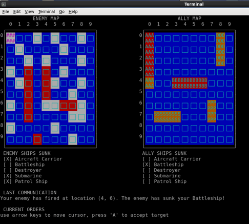

# Networked BattleShip Game

> [networkedBattleship](doc/Networked_Battleship_Game_Presentation.pdf) - a BattleShip game written in C++

This repository provides the implementation of a turn-based Networked BattleShip 
game using socket programming principles. The game can be played either between 
two remote players using client-server communication or against the computer AI 
as a single player.

It is written in C++ by Mert Türkol, Roberto Shu and Alexander Vaughn as part 
of a coursework project in EECS402: Computer Programming For Scientists and Engineers,
offered at the University of Michigan.



## Table of Contents

<!-- vim-markdown-toc GFM -->

* [Documentation](#documentation)
* [Installation](#installation)
    * [Requirements](#requirements)
    * [Compilation](#compilation)
* [Usage](#usage)

<!-- vim-markdown-toc -->

## Documentation

For a presentation describing the project and the algorithm flow, please see the following:
  * [Networked Battleship Game Presentation](doc/Networked_Battleship_Game_Presentation.pdf)

## Installation

### Requirements

Make sure you have the `ncurses` library installed. Below are the installation instructions if you don't have it.

#### Installing the ncurses library in Debian/Ubuntu Linux

  1.  You need to install the following two packages:
  
      `libncurses5-dev` : Developer’s libraries for ncurses
      
      `libncursesw5-dev` : Developer’s libraries for ncursesw
  2.  Open the Terminal application.
  3.  Type the following `apt-get` command to install `ncurses` header and libs:
      ```
      $ sudo apt-get install libncurses5-dev libncursesw5-dev
      ```

#### Installing the ncurses library in CentOS/RHEL/Scientific Linux 6.x/7.x+ and Fedora Linux 21 or older

  1.  You need to install the following package:
  
      `ncurses-devel` : Developer’s libraries for ncurses
  2.  Open the Terminal application.
  3.  Type the following `yum` command to install `ncurses` header and libs:
      ```
      $ sudo yum install ncurses-devel
      ```     
      
#### Installing the ncurses library in Fedora Linux 22.x+

  1.  You need to install the following package:
  
      `ncurses-devel` : Developer’s libraries for ncurses
  2.  Open the Terminal application.
  3.  Type the following `dnf` command to install `ncurses` header and libs:
      ```
      $ sudo dnf install ncurses-devel
      ```     
            
### Compilation

The `makefile` utilizes `g++` to compile `networkedBattleship`. Simply type:

```
$ make
```

An executable named `networkedBattleship.exe` will be produced under the same directory.

## Usage

`networkedBattleship` can be called from the command line: 

```
$ ./networkedBattleship.exe
```

Upon execution, the interactive game menu will appear and present the options 
to host/join a game against a remote human opponent or to play against the computer AI.   
  